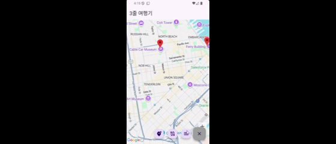
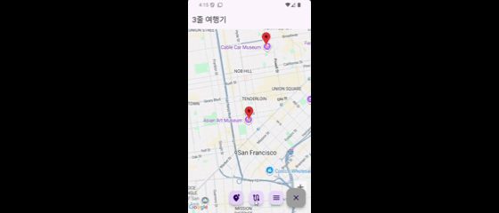
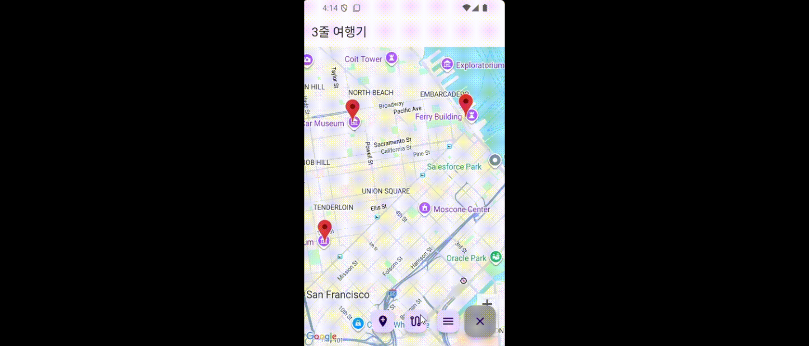

> 🚧 **Note:** 이 프로젝트는 현재 개발 중인 미완성 프로젝트임.

# Three Line Journey (짧은 글 여행기)

Flutter와 Google Maps API, MongoDB를 기반으로 사용자의 여행기를 기록하고 공유하는 모바일 애플리케이션. 각 여행기는 짧은 글과 사진으로 요약되어 지도 위에 시각적으로 표현됨.

## 🚀 개발 동기 및 목표

단순히 위치를 기록하는 것을 넘어, 각 장소에 담긴 개인의 경험과 감성을 짧은 글과 사진으로 함축하여 표현하고, 이를 다른 사람들과 공유하는 새로운 형태의 소셜 매핑 서비스를 만들고자 함. Flutter의 크로스플랫폼 이점을 활용하여 iOS와 Android에서 모두 동작하는 애플리케이션을 개발하는 것을 목표로 함.

## 🎬 프로젝트 데모 (Demo)

### 1. 로그인

### 2. 마커 관리

### 3. 여행기 관리

## ✨ 주요 기능 (Features)

*   **지도 기반 인터페이스**: `google_maps_flutter`를 사용하여 지도를 앱의 핵심 인터페이스로 활용함.
*   **마커(Marker) 추가**: 사용자는 지도 위의 특정 위치에 마커를 추가하고, 해당 장소에 대한 정보(제목, 설명, 사진)를 기록할 수 있음.
*   **여행기(Journey) 생성**: 여러 개의 마커를 묶어 하나의 '여행기'로 만들 수 있음. 각 여행기는 경로(Polyline)로 지도에 표시됨.
*   **짧은 글 및 사진**: 각 여행기는 짧은 글과 함께 여러 장의 사진을 첨부하여 풍부한 맥락을 전달함.
*   **사용자 인증 및 데이터 관리**: MongoDB를 백엔드 데이터베이스로 사용하여 사용자 계정 정보와 모든 마커/여행기 데이터를 안전하게 저장하고 관리함.
*   **상태 관리**: `Provider`를 사용하여 앱 전역의 사용자 상태와 데이터 변경을 효율적으로 관리하고 UI에 실시간으로 반영함.

## 📐 아키텍처 (Architecture)

MVC(Model-View-Controller) 패턴과 유사한 구조를 채택하여 코드의 역할과 책임을 분리함.

*   **Model**: `models` 디렉토리의 `user.dart`, `journey.dart`, `marker.dart` 등이 데이터 구조를 정의함. 각 모델은 `toJson`, `fromJson` 메서드를 포함하여 MongoDB와의 데이터 직렬화/역직렬화를 처리함.
*   **View**: `views` 디렉토리의 `main_screen.dart`, `login_screen.dart` 등 사용자에게 보여지는 UI 화면을 구성함. 사용자의 입력을 받아 Controller에 전달하는 역할을 함.
*   **Controller**: `controllers` 디렉토리의 `db_controller.dart`, `maps_controller.dart`가 핵심 비즈니스 로직을 담당함. View로부터 받은 요청을 처리하고, Model을 업데이트하며, 데이터베이스와의 통신을 관리함.
*   **Global State**: `globalUser.dart`와 `Provider`를 통해 로그인된 사용자 정보를 앱 전역에서 접근 가능한 상태로 관리하여, 여러 위젯에서 사용자 데이터에 일관되게 접근할 수 있도록 함.

## 🛠️ 기술 스택 (Tech Stack)

*   **Framework**: `Flutter`
*   **Language**: `Dart`
*   **Database**: `MongoDB Atlas`
*   **Core Libraries**:
    *   `google_maps_flutter`: 핵심 지도 기능 구현
    *   `mongo_dart`: MongoDB 데이터베이스 연동
    *   `provider`: 상태 관리

## 🤔 기술적 문제 해결 사례

### 1. Provider 상태 변경 후 UI가 갱신되지 않는 문제

*   **문제**
    사용자가 새 마커를 추가하거나 기존 마커를 삭제했을 때, 데이터는 MongoDB와 `GlobalUser` Provider 상태에는 정상적으로 반영되었지만, 지도 위나 마커 목록 UI에는 즉시 변경사항이 나타나지 않는 문제가 발생함. UI를 갱신하기 위해서는 다른 화면으로 이동했다가 돌아와야만 했음.

*   **원인 분석**
    `maps_controller`에서 마커를 추가/삭제하는 로직은 `Provider.of<GlobalUser>(context, listen: false)`를 사용하여 상태를 변경하고 있었음. `listen: false`는 상태 변경 시 위젯을 다시 빌드하지 않도록 하는 옵션으로, 상태를 '변경'만 하는 함수 내에서 사용하는 것은 올바른 방식임. 문제는 상태를 '표시'해야 하는 `main_screen.dart`의 `build` 메서드에서도 UI 갱신을 위한 상태 구독을 제대로 하고 있지 않았기 때문임. 단순히 `Provider.of`를 `listen: false`로 호출하여 데이터를 가져오기만 하면, `GlobalUser`의 `notifyListeners()`가 호출되어도 위젯은 변화를 감지하지 못함.

*   **해결**
    상태 변화에 따라 다시 그려져야 하는 위젯만 정확히 재빌드하기 위해 `Consumer` 위젯을 도입함.
    1.  **GoogleMap 위젯 래핑**: `main_screen.dart`에서 `GoogleMap` 위젯을 `Consumer<GlobalUser>` 위젯으로 감싸줌. `Consumer`의 `builder` 함수는 `GlobalUser`의 상태가 변경될 때마다 호출되므로, `builder` 내에서 `mapsController.getMarkers(context)`를 호출하여 항상 최신 마커 목록을 지도에 전달하도록 수정함.
    2.  **하단 시트 목록 래핑**: 마커 및 여행기 목록을 보여주는 하단 모달 시트(`showModalBottomSheet`) 내부의 `MarkerListView`와 `AddJourneyDialog` 위젯 또한 `Consumer<GlobalUser>`로 감싸, 상태 변경 시 목록이 즉시 갱신되도록 동일한 패턴을 적용함.

*   **결과**
    `Consumer` 위젯을 통해 상태 변화를 구독할 대상을 명확히 지정함으로써, 불필요한 위젯의 재빌드를 막고 성능을 최적화함. 동시에, 사용자의 액션(마커 추가/삭제 등)이 UI에 즉각적으로 반영되는 반응형 사용자 경험을 구현함. 이를 통해 상태 변경 로직과 UI 렌더링 로직의 분리라는 Provider 패턴의 장점을 명확히 활용하는 구조를 정립하게 됨.

## 🤔 개발 중인 기능 및 고려사항

*   **소셜 기능 확장**: 다른 사용자의 여행기를 구독하거나 '좋아요'를 누르는 등의 소셜 기능 추가 계획.
*   **검색 기능**: 특정 장소나 키워드로 마커나 여행기를 검색하는 기능 구현 예정.
*   **성능 최적화**: 대량의 마커와 폴리라인을 지도에 표시할 때 발생할 수 있는 성능 저하 문제를 해결하기 위해, 지도 클러스터링(Clustering) 및 가시 영역 기반 데이터 로딩 최적화 고려 중.
*   **UI/UX 개선**: 현재 기능 구현에 집중하고 있으며, 추후 사용자 경험을 향상시키기 위한 전반적인 UI/UX 디자인 개선 작업 진행 예정.